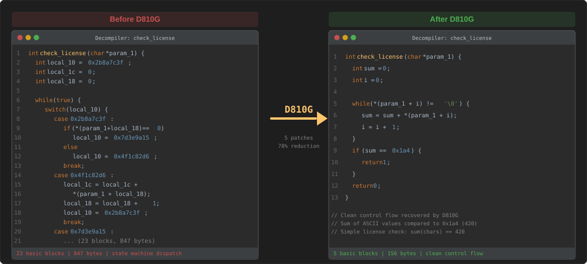
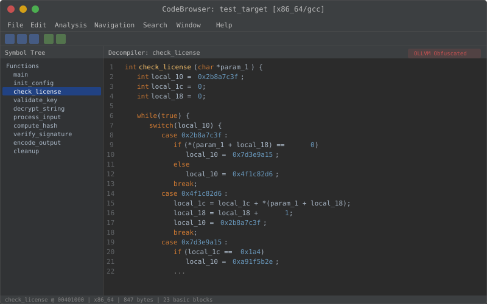
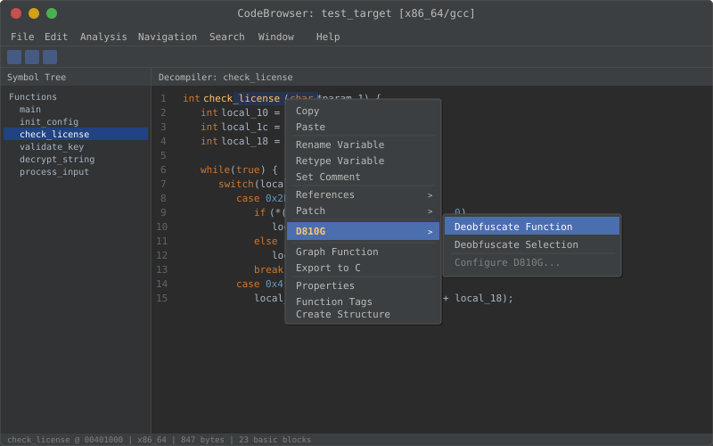
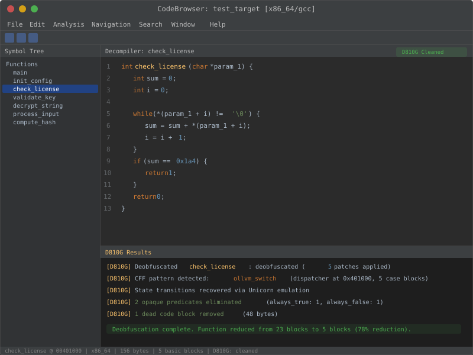
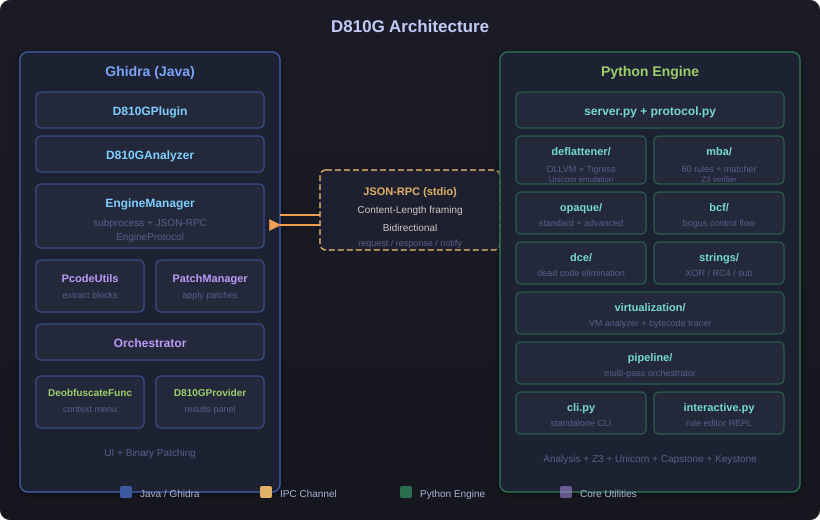
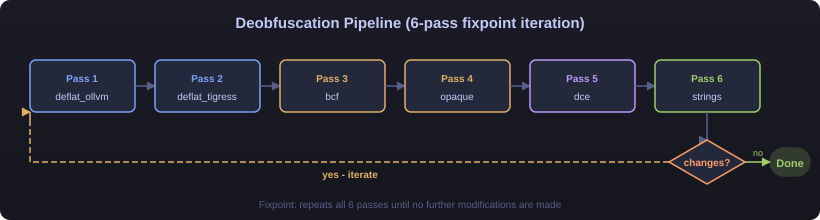

[English](README.md) | **中文**

# D810G

**Ghidra 反混淆框架** -- 最全面的开源 Ghidra 逆向工程平台反混淆工具包。

D810G 将 [D-810](https://gitlab.com/eshard/d810) 级别的反混淆能力带入 Ghidra。它采用 Java + Python 混合架构：Ghidra 插件负责 UI 和二进制修补，Python 引擎借助 Z3、Unicorn、Capstone 和 Keystone 执行深度分析。


---

## 核心特性

| 模块 | 说明 |
|------|------|
| **控制流平坦化还原** | 通过 Unicorn 模拟执行恢复 OLLVM + Tigress CFF |
| **MBA 表达式化简** | 60 条规则，多轮迭代化简，Z3 等价性验证 |
| **不透明谓词消除** | 标准 + 高级（数论、整数算术） |
| **虚假控制流移除** | 检测并剥离由不透明谓词保护的虚假分支 |
| **死代码消除** | BFS 可达性分析 + NOP 填充 |
| **字符串解密** | XOR、多字节 XOR、RC4、替换表、ROT-N |
| **VM 反虚拟化** | Tigress VM 分发器检测、handler 分类、字节码追踪 |
| **完整流水线** | 6 趟自动链式处理，不动点迭代 |
| **独立 CLI** | 无需 Ghidra 即可使用：`simplify`、`opaque`、`interactive`、`pipeline` |
| **Ghidra 分析器** | 分析过程中一键自动反混淆 |

---

## 快速开始（CLI -- 无需 Ghidra）

```bash
git clone https://github.com/overkazaf/D810G.git
cd D810G
python3 -m venv .venv && source .venv/bin/activate
pip install z3-solver unicorn keystone-engine capstone
```

### MBA 表达式化简

```
$ PYTHONPATH=python python -m d810g_engine cli simplify "(x | y) - (x & y)"
  (x | y) - (x & y)
  → (x ^ y) (Z3 verified)
  Rule: mba_xor_1
```

<p align="center">
  
</p>

### 多轮深度化简

```
$ PYTHONPATH=python python -m d810g_engine cli simplify --deep \
    "((x | y) - (x & y)) ^ ((x | y) - (x & y))"
  ((x | y) - (x & y)) ^ ((x | y) - (x & y))
  → ((x ^ y) ^ ((x | y) - (x & y)))  (step 1, mba_xor_1)
  → ((x ^ y) ^ (x ^ y))              (step 2, mba_xor_1)
  → 0                                 (step 3, mba_zero_1)
  Final: Z3 verified equivalent
  Iterations: 3, fixpoint: True
```

<p align="center">
  
</p>

### 不透明谓词检测

```
$ PYTHONPATH=python python -m d810g_engine cli opaque "x == x"
  x == x
  → ALWAYS TRUE  — opaque, can be eliminated

$ PYTHONPATH=python python -m d810g_engine cli opaque "(x & 1) == 2"
  (x & 1) == 2
  → ALWAYS FALSE — opaque, can be eliminated

$ PYTHONPATH=python python -m d810g_engine cli opaque "x > 5"
  x > 5
  → DYNAMIC      — real condition, keep as-is
```

<p align="center">
  
</p>

### 交互式规则编辑器

```
$ PYTHONPATH=python python -m d810g_engine cli interactive
  D810G Interactive Rule Editor
  Loaded 60 rules from 4 files

d810g> test (x | y) - (x & y)
  → (x ^ y)  [Z3 verified]
     Rule: mba_xor_1

d810g> verify (x & y) + (x ^ y) = x | y
  8-bit:  EQUIVALENT
  16-bit: EQUIVALENT
  32-bit: EQUIVALENT
  64-bit: EQUIVALENT

d810g> add my_rule ~(~x & ~y) = x | y
  Added rule 'my_rule': ~(~x & ~y) -> x | y [verified]
```

### 所有 CLI 命令

```bash
PYTHONPATH=python python -m d810g_engine cli simplify "<expr>"      # 单次化简
PYTHONPATH=python python -m d810g_engine cli simplify --deep "<expr>" # 多轮化简
PYTHONPATH=python python -m d810g_engine cli opaque "<condition>"    # 谓词分类
PYTHONPATH=python python -m d810g_engine cli rules                   # 列出全部 60 条规则
PYTHONPATH=python python -m d810g_engine cli rules --verify          # Z3 验证所有规则
PYTHONPATH=python python -m d810g_engine cli batch < exprs.txt       # 批量化简
PYTHONPATH=python python -m d810g_engine cli interactive             # REPL 交互模式
PYTHONPATH=python python -m d810g_engine cli pipeline input.json     # 完整流水线
```

---

## 演示脚本

D810G 附带 8 个交互式演示脚本，展示每个模块的功能。可以一键运行全部，也可以单独运行：

```bash
# 运行全部演示
PYTHONPATH=python python demo/demo_all.py

# 单独运行
PYTHONPATH=python python demo/demo_mba.py         # MBA 简化（7 个示例 + Z3 证明表）
PYTHONPATH=python python demo/demo_deep_mba.py     # 多轮迭代深度简化
PYTHONPATH=python python demo/demo_opaque.py       # 不透明谓词检测（always_true/false/dynamic）
PYTHONPATH=python python demo/demo_bcf.py          # 伪造控制流移除（3 层 BCF + ASCII 图示）
PYTHONPATH=python python demo/demo_deflat.py       # 控制流反平坦化（OLLVM 状态机）
PYTHONPATH=python python demo/demo_strings.py      # 字符串解密（XOR / RC4 / 多字节 / ROT-N）
PYTHONPATH=python python demo/demo_vm.py           # VM 反虚拟化（handler 表 + Fibonacci 伪代码）
PYTHONPATH=python python demo/demo_pipeline.py     # 完整 6-pass 流水线 + fixpoint 迭代
```

---

## Ghidra 集成

### 插件（手动安装）

1. 构建扩展（参见[从源码构建](#从源码构建)）
2. 在 Ghidra 中：**File > Install Extensions > Add extension**（选择 zip 文件）
3. 右键任意函数 → **D810G > Deobfuscate Function**
4. 结果显示在 **D810G Results** 面板中

### 分析器（自动模式）

D810G 内置 Ghidra `Analyzer`，可在分析过程中自动检测并反混淆函数：

1. 打开 **Analysis > Auto Analyze** 选项
2. 启用 **D810G Deobfuscation**
3. 运行分析 -- D810G 会扫描所有函数的混淆模式，并对可疑函数进行反混淆

### 无头脚本

```bash
analyzeHeadless /path/to/project Project -import binary.exe \
    -postScript headless_deobfuscate.py
```

### 截图

<p align="center">
  
</p>

<details>
<summary>更多截图</summary>

**混淆代码（反混淆前）：**

<p align="center">
  
</p>

**右键菜单反混淆：**

<p align="center">
  
</p>

**清晰代码（反混淆后）：**

<p align="center">
  
</p>

</details>

---

## 架构



### 反混淆流水线

完整流水线按最优顺序执行 6 趟处理，循环迭代直到无更多变更：



---

## 支持的混淆技术

| 技术 | 状态 | 详情 |
|------|------|------|
| OLLVM 控制流平坦化 | ✅ | Switch-dispatch + Unicorn 模拟执行 + Keystone 修补 |
| Tigress CFF（间接跳转） | ✅ | 跳转表检测与解析 |
| Tigress CFF（if 链） | ✅ | 顺序比较链检测 |
| OLLVM 虚假控制流 | ✅ | 不透明谓词保护的虚假分支移除 |
| MBA 表达式 | ✅ | 60 条规则，多轮迭代，子表达式递归化简 |
| 不透明谓词（标准） | ✅ | Z3 位向量可满足性分析 |
| 不透明谓词（高级） | ✅ | 整数算术回退 + 数论模式 |
| 死代码消除 | ✅ | BFS 可达性 + NOP 填充（x86/ARM64/ARM32） |
| 字符串加密（XOR） | ✅ | 单字节、多字节、XOR-with-index |
| 字符串加密（RC4） | ✅ | 暴力搜索密钥 |
| 字符串加密（替换表） | ✅ | ROT-N 及自定义查找表 |
| Tigress VM（检测） | ✅ | 分发器检测 + handler 分类 |
| Tigress VM（字节码追踪） | ✅ | 执行模拟 + 伪代码生成 |
| 完整流水线 | ✅ | 6 趟自动链式处理，不动点迭代 |
| 独立 CLI | ✅ | simplify、opaque、rules、batch、interactive、pipeline |
| Ghidra 分析器 | ✅ | 自动分析集成 |
| Ghidra 无头模式 | ✅ | 通过 `analyzeHeadless` 批量扫描 |

### 架构支持

| 架构 | 控制流还原 | 二进制修补 | 死代码消除 |
|------|-----------|-----------|-----------|
| x86_64 | ✅ | ✅ | ✅ |
| ARM64 (AArch64) | ✅ | ✅ | ✅ |
| ARM32 | ✅ | ✅ | ✅ |

---

## MBA 规则集

D810G 内置 **60 条规则**，分布在 4 个规则文件中：

| 规则集 | 数量 | 说明 |
|--------|------|------|
| `mba_basic.json` | 10 | 基本 MBA 恒等式（XOR、AND、OR 等价关系） |
| `mba_hackers_delight.json` | 25 | 《Hacker's Delight》位操作技巧（abs、min、max、De Morgan） |
| `mba_ollvm.json` | 15 | OLLVM 指令替换模式 |
| `mba_constant_folding.json` | 10 | 代数恒等式与常量折叠 |

### 添加自定义规则

在 `data/rules/` 中创建 JSON 文件：

```json
{
  "name": "my_rules",
  "description": "Custom MBA rules",
  "rules": [
    {
      "id": "my_xor_1",
      "pattern": "(x | y) ^ (x & y)",
      "replacement": "x ^ y",
      "commutative": true,
      "description": "XOR via OR XOR AND"
    }
  ]
}
```

或使用交互式编辑器：
```bash
PYTHONPATH=python python -m d810g_engine cli interactive
d810g> add my_rule (x | y) ^ (x & y) = x ^ y
d810g> save my_rules.json
```

---

## 安装

### 方式一：仅 CLI（无需 Ghidra）

```bash
git clone https://github.com/overkazaf/D810G.git
cd D810G
python3 -m venv .venv && source .venv/bin/activate
pip install z3-solver unicorn keystone-engine capstone
```

### 方式二：Ghidra 扩展

```bash
# 构建
export GHIDRA_INSTALL_DIR=/path/to/ghidra_11.x
cd D810G
$GHIDRA_INSTALL_DIR/support/gradle/gradlew buildExtension

# 安装
# 在 Ghidra 中：File > Install Extensions > 选择 dist/*.zip
# 在扩展目录中设置 venv：
cd <ghidra_extensions>/D810G
python3 -m venv .venv && source .venv/bin/activate
pip install z3-solver unicorn keystone-engine capstone
```

---

## 从源码构建

### 前置要求

- JDK 17+
- Ghidra 11.x
- Python 3.11+
- `pip install z3-solver unicorn keystone-engine capstone pytest`

### 构建与测试

```bash
# 构建 Ghidra 扩展
export GHIDRA_INSTALL_DIR=/path/to/ghidra
$GHIDRA_INSTALL_DIR/support/gradle/gradlew buildExtension

# 运行全部 201 个测试
source .venv/bin/activate
PYTHONPATH=python python -m pytest test/ -v
```

<p align="center">
  
</p>

### 测试模块

```bash
python -m pytest test/test_deflattener.py     # CFF + Unicorn 模拟 (12 tests)
python -m pytest test/test_tigress.py         # Tigress 变体 (6 tests)
python -m pytest test/test_mba.py             # MBA 匹配 (9 tests)
python -m pytest test/test_mba_extended.py    # 60 规则 Z3 验证 (41 tests)
python -m pytest test/test_mba_deep.py        # 多轮化简 (8 tests)
python -m pytest test/test_opaque.py          # 不透明谓词 (6 tests)
python -m pytest test/test_opaque_advanced.py # 高级谓词 (11 tests)
python -m pytest test/test_bcf.py             # 虚假控制流 (10 tests)
python -m pytest test/test_dce.py             # 死代码消除 (14 tests)
python -m pytest test/test_strings.py         # 字符串解密 (19 tests)
python -m pytest test/test_virtualization.py  # VM 分析 (13 tests)
python -m pytest test/test_vm_tracer.py       # 字节码追踪 (13 tests)
python -m pytest test/test_pipeline.py        # 完整流水线 (9 tests)
python -m pytest test/test_cli.py             # CLI 命令 (7 tests)
python -m pytest test/test_interactive.py     # 交互式编辑器 (10 tests)
python -m pytest test/test_protocol.py        # IPC 协议 (4 tests)
python -m pytest test/test_integration.py     # 集成测试 (9 tests)
```

---

## 项目结构

```
D810G/
├── src/main/java/d810g/         # Ghidra 插件 (Java)
│   ├── D810GPlugin.java         # 插件入口
│   ├── D810GAnalyzer.java       # 自动分析集成
│   ├── engine/                  # Python 进程管理 + JSON-RPC
│   ├── core/                    # Orchestrator, PatchManager, PcodeUtils
│   ├── actions/                 # 右键菜单操作
│   └── ui/                      # 结果面板
├── python/d810g_engine/         # 分析引擎 (Python)
│   ├── server.py                # JSON-RPC 服务端
│   ├── cli.py                   # 独立 CLI
│   ├── interactive.py           # 交互式规则编辑器
│   ├── deflattener/             # OLLVM + Tigress + Unicorn
│   ├── mba/                     # 规则 + 匹配器 + Z3 验证器
│   ├── opaque/                  # 标准 + 高级谓词
│   ├── bcf/                     # 虚假控制流
│   ├── dce/                     # 死代码消除
│   ├── strings/                 # 字符串解密 (XOR/RC4/sub)
│   ├── virtualization/          # VM 分析 + 字节码追踪器
│   └── pipeline/                # 多趟编排器
├── data/rules/                  # MBA 规则定义 (60 条规则)
├── test/                        # 201 个测试
├── demo/                        # 演示脚本
├── scripts/                     # 无头分析脚本
└── .github/workflows/           # CI (Python 3.11/3.12/3.13)
```

---

## 致谢

D810G 的灵感来自：
- [D-810](https://gitlab.com/eshard/d810) -- eShard 开发的原版 IDA Pro 反混淆插件
- [D-810-ng](https://github.com/nickcano/D-810-ng) -- 社区维护的更新分支

D810G 致力于将这些能力以及更多功能带入 Ghidra 逆向工程生态系统。

---

## 许可证

Apache License 2.0。详见 [LICENSE](LICENSE)。
