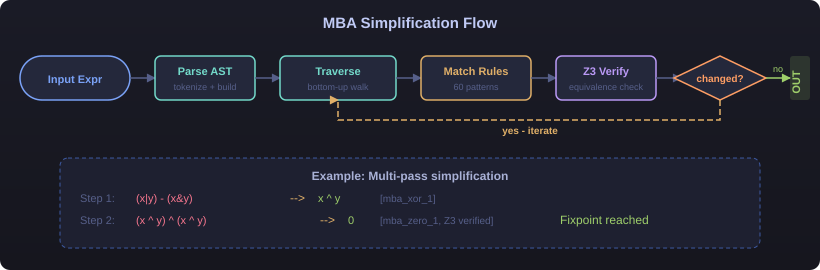

**English** | [中文](cn/)

# D810G

**The most comprehensive open-source deobfuscation toolkit for Ghidra.**

D810G brings IDA Pro D-810 level deobfuscation to the Ghidra ecosystem — control flow deflattening, MBA simplification, opaque predicate elimination, string decryption, VM devirtualization, and more.

## Why D810G?

| Feature | IDA D-810 | Ghidra (without D810G) | D810G |
|---------|-----------|----------------------|-------|
| Control Flow Deflattening | ✅ | ❌ | ✅ OLLVM + Tigress |
| MBA Simplification | ✅ 200+ rules | ❌ | ✅ 60 rules (extensible) |
| Opaque Predicate Elimination | ✅ | ❌ | ✅ Standard + Advanced |
| Bogus Control Flow | ✅ | ❌ | ✅ |
| Dead Code Elimination | ✅ | ❌ | ✅ |
| String Decryption | ✅ | ❌ | ✅ XOR/RC4/Substitution |
| VM Devirtualization | ❌ | ❌ | ✅ |
| Multi-pass Pipeline | ✅ | ❌ | ✅ |
| Standalone CLI | ❌ | N/A | ✅ |
| Free & Open Source | ❌ ($2,700+) | ✅ | ✅ |

## Quick Demo

### MBA Simplification

```
$ d810g cli simplify --deep "((x | y) - (x & y)) ^ ((x | y) - (x & y))"

  ((x | y) - (x & y)) ^ ((x | y) - (x & y))
  → ((x ^ y) ^ ((x | y) - (x & y)))  (step 1, mba_xor_1)
  → ((x ^ y) ^ (x ^ y))              (step 2, mba_xor_1)
  → 0                                 (step 3, mba_zero_1)
  Final: Z3 verified equivalent
```

<p align="center">
  
</p>

### Opaque Predicate Detection

```
$ d810g cli opaque "x == x"
  → ALWAYS TRUE  — opaque, can be eliminated

$ d810g cli opaque "(x & 1) == 2"
  → ALWAYS FALSE — opaque, can be eliminated

$ d810g cli opaque "x > 5"
  → DYNAMIC      — real condition, keep as-is
```

<p align="center">
  
</p>

## Architecture


### Deobfuscation Pipeline


### MBA Simplification



## Get Started

```bash
git clone https://github.com/overkazaf/D810G.git
cd D810G
python3 -m venv .venv && source .venv/bin/activate
pip install z3-solver unicorn keystone-engine capstone
PYTHONPATH=python python -m d810g_engine cli simplify "(x | y) - (x & y)"
```

[Full Documentation →](https://github.com/overkazaf/D810G#readme)

## Modules

- [Control Flow Deflattening](modules/deflattening)
- [MBA Simplification](modules/mba)
- [Opaque Predicates](modules/opaque)
- [String Decryption](modules/strings)
- [VM Devirtualization](modules/virtualization)
- [Pipeline](modules/pipeline)

## Demo Scripts

D810G includes 8 interactive demos — run them all with one command:

```bash
PYTHONPATH=python python demo/demo_all.py
```

| Demo | Description |
|------|-------------|
| `demo_mba.py` | MBA simplification — 7 examples with Z3 proof table |
| `demo_deep_mba.py` | Multi-pass iterative simplification with step-by-step chain |
| `demo_opaque.py` | Opaque predicate detection — always_true / always_false / dynamic |
| `demo_bcf.py` | Bogus control flow — 3-layer BCF removal with ASCII diagrams |
| `demo_deflat.py` | Control flow deflattening — OLLVM state machine detection |
| `demo_strings.py` | String decryption — XOR, RC4, multi-byte XOR, ROT-N |
| `demo_vm.py` | VM devirtualization — handler table + Fibonacci pseudocode |
| `demo_pipeline.py` | Full 6-pass pipeline with fixpoint iteration |

## Stats

- **201** tests
- **60** MBA rules
- **25** commits
- **3** architectures (x86_64, ARM64, ARM32)
- **6** deobfuscation passes
- **4** string decryption methods
